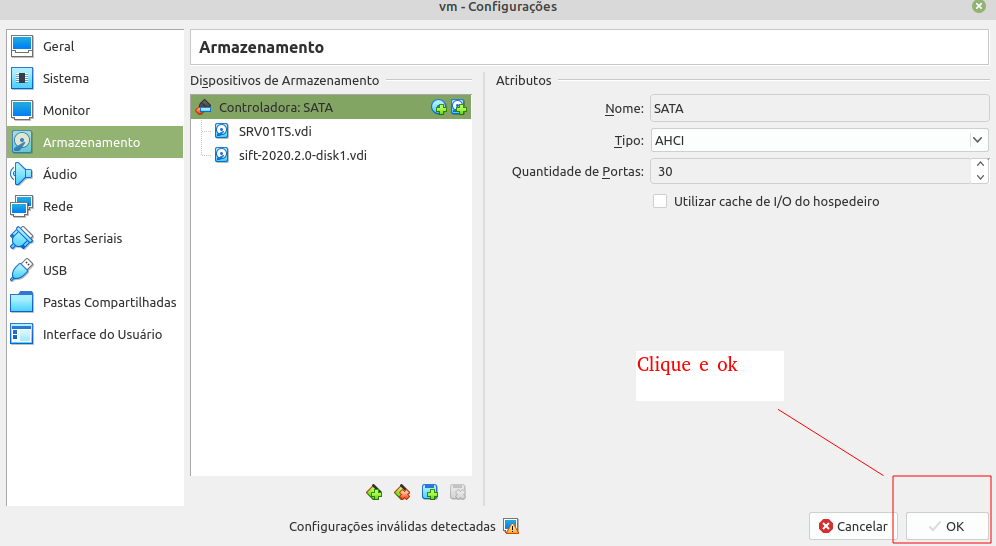

# Montagem de imagem de Disco Virtual no Virtualbox para Análise de Incidente

## Escopo

Primeiro Passo para realização de uma análise de Incidente é a coleta da evidência. Essa coleta pode ser feita de várias formas diferentes. Vamos nos concentrar aqui em um DUMP do disco. Essa pode ser uma imagem forense, gerada por meio do ftk por exemplo, ou uma imagem de Máquina virtual que podem ter os seguintes formatos: vdi, vmdk, vmdkx, qcow, qcow2, etc..

Esse Documento tem como objetivo mostrar dois pontos envolvendo montagem de um Disco Vitual para analise:

1 - Mostrar de maneira resumida, como montar um disco virtual em uma estação Desktop Linux.

2 - Mostrar como montar um disco virtual em uma estação virtual forense Sans Sift, baseado no virtualbox.

## Maneiras de "Explorar"

Se for utilizar um Linux Desktop para fazer a análise, é importante lembrar que uma série de pacotes precisarão ser instalados para que isso possa ser possível, ao passo que a utilização de uma estação virtual forense, isso já não é necessário, visto que todos os pacotes iniciais para analise já se econtram instalados.

Existem duas formas de explorar o arquivo no linux. Pode montar diretamente por meio do "mount", ou montar por meio de um hypervisor, por exemplo VirtualBox.

Nesse tutorial, utilizei uma imgem de disco baseado na Virtualização do Windows, Hyper-V. Mas pode ser utilizado para converter arquivos de disco de vários tipos de virtualizações.

## Exetensão do arquivo

.vhdx 

## Tipo de Vitualização

 Windows Hyper-V .

# Para montar imagem de disco direto no Desktop linux

        # guestmount --add Caminho/arquivo/ imagem.vhdx --inspector --ro /ponto de montagem

Provavelmente será necessário instalar o pacote libguestfs tools.

        # apt-get install libguestfs-tools.

Se estiver usando uma estação virtual forense, tipo Sans-Sift, no virtualbox, precisará montar esse disco como disco virtual adicionando á máquina virtual. Para isso será necessário seguir alguns passos.

## Montagem de Disco virtual em estação Linux Forense Virtual - Virtualbox

1 - Converter o arquivo. Para isso, pode utilizar o comando vboxmanage.

        vboxmanage clonehd inputFileName.vhdx outputFileName.vdi --format vdi

Obs. Ele não gera hash automaticamente. Precisará combinar esse comando com outros comandos através do " | " para gerar um arquivo de hash na hora da conversão do arquivo de disco.

        vboxmanage clonehd Virtual\ Hard\ Disks/imagem.vhdx imagem.vdi --format vdi | sha256sum >sha256sum.txt

2 - Adicionar o disco a vm do virtualbox.

    Para adicionar o dico a vm (no meu caso o sans-sift da Sans. Mas pode ser qualquer Linux), seguir o seguinte caminho:

        Vitualbox/ VM/ (Menu) Configurações/ Armazenamento/ Controlador Sata/ Acrescentar Disco rígido/ procurar disco virtual/ Depois do disco adicionado, clicar em "ok" pra salvar

Obs: Talvez seja  necessário alterar a ordem do boot da máquina virtual durante a inicialização.

3 - Montar o Disco como somente leitura na Estação Forenese virtual.

Quando a máquina virtual sans iniciar, entre como sudo e dê o seguinte comando para verificar se ele está encontrando o Disco virtual adicionado.

        # fidisk -l
    
Lembrando que se esse disco estiver em primero, ele irá inverter a ordem dos discos. O Disco da máquina virtual sans, ele irá atribuir como sdb,  e o disco virtual adicionado,  ele irá atribuir como sda.

Para montar o disco, basta dar comando "mount" como exemplo:

        mount /dev/(disco) /mnt/(Ponto de Montagem)

        Exemplo: mount -r /dev/sda3 /mnt/windows_mount

Entrando no diretório /mnt/windows_mount , na estação sift poderá visualizar os arquivos do Windows montado.

Importante lembrar que,  para não haver problemas, é necessário montar como somente leitura.

        

