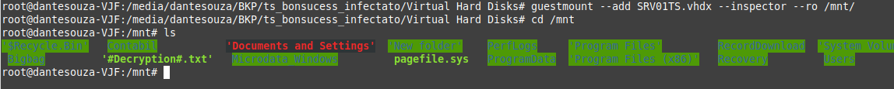
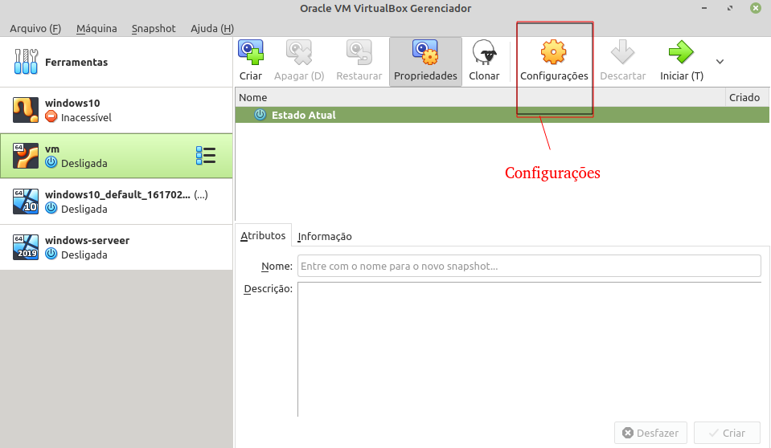
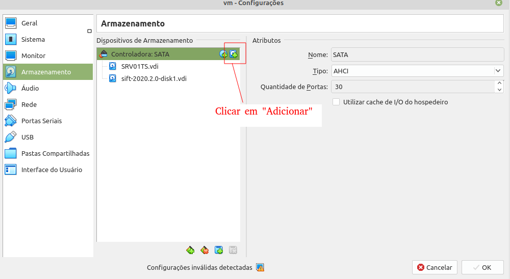
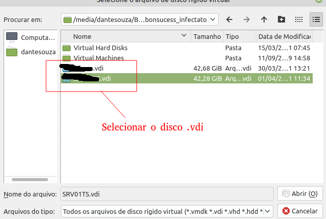
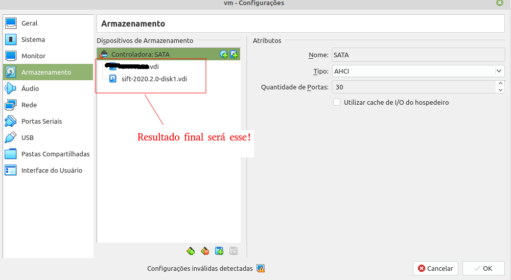
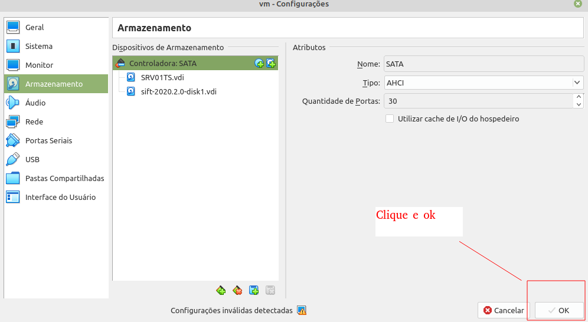

# Primeiro Passo é a coleta da evidência. Essa pode ser uma imagem forense, gerada por meio do ftk por exemplo, ou uma imagem de máquina virtual

Por exemplo: vdi;vmdk;vmdkx, qcow, qcow2, etc..

# Tutorial para verificação de arquivo de máquina virtual infectada.

## Arquivo: imgem.vhdx
## Tipo de Vitualização: Windows hyper-v

Existem duas formas de explorar o arquivo no linux. Pode montar diretamente por meio do "mount", ou montar por meio de um hypervisor, por exemplo VirtualBox.

# Para montar direto no linux:
 guestmount --add Caminho/arquivo/imagem.vhdx --inspector --ro /ponto de montagem

## Exemplo:
 guestmount --add imagem.vhdx --inspector --ro /mnt

Mas se você estiver usando uma estação virtual forense, tipo Sans-Sift, no virtual box,  você precisará montar esse disco como disco virtual adicionando -o ao máquina virtual. Mas para isso será necessário seguir alguns passos;

## Montagem de Disco virtual em estação Linux Forense Virtual - Virtualbox

1 - Será necessário converter o arquivo. Para isso, pode utilizar o comando vboxmanage

        vboxmanage clonehd inputFileName.vhdx outputFileName.vdi --format vdi

    Nesse caso, o comando será:

        vboxmanage clonehd imagem.vhdx imagem.vdi --format vdi

    Obs. Ele não gera hash automaticamente. Portanto, se for necessário gerar uma hash, precisará combinar esse comando com outros comandos através do " | " para gerar um arquivo de hash na hora da conversão do arquivo de disco.

        vboxmanage clonehd Virtual\ Hard\ Disks/imagem.vhdx imagem.vdi --format vdi | sha256sum >sha256sum.txt

2 - Adicionar o disco a vm do virtualbox.

    Para adicionar o dico a vm (no meu caso o sans-sift da Sans. Mas pode ser qualquer Linux), seguir o seguinte caminho:

        Vitualbox/ VM/ (Menu) Configurações/ Armazenamento/ Controlador Sata/ Acrescentar Disco rígido/ procurar disco virtual/ Depois do disco adicionado, clicar em "ok" pra salvar

3 - Montar o Disco como somente leitura na Estação Forenese virtual.

        

